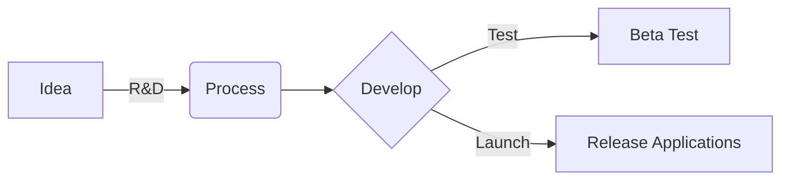

✍️ **Polygon IDM Proposal** [here](https://github.com/blue-lotus-lab/IDM-polygon/tree/main)

#

```
          888888b.   888                       888               888                      
          888  "88b  888                       888               888                      
          888  .88P  888                       888               888                      
          8888888K.  888 888  888  .d88b.      888       .d88b.  888888 888  888 .d8888b  
          888  "Y88b 888 888  888 d8P  Y8b     888      d88""88b 888    888  888 88K      
          888    888 888 888  888 88888888     888      888  888 888    888  888 "Y8888b. 
          888   d88P 888 Y88b 888 Y8b.         888      Y88..88P Y88b.  Y88b 888      X88 
          8888888P"  888  "Y88888  "Y8888      88888888  "Y88P"   "Y888  "Y88888  88888P' 

                  Open-source Blockchain tools presented by lotuschain.org , 2023
```

# BlueLotus


**Blue Lotus**, also known as **LotusChain**, is at the forefront of developing and integrating decentralized applications (dapps) that leverage blockchain technology to revolutionize various industries. Our dapps, including **dCDN**, **ALT**, **ALP**, **ALT-IDM**, and **ALT-Audit**, showcase their commitment to utilizing the decentralized nature of blockchain networks to provide more efficient, secure, and scalable solutions.\
[**LotusChain Product**] - [shoot pitch](https://github.com/blue-lotus-org/lotus-products)

- **Github**: [Repositories](https://github.com/blue-lotus-org)
- **Publish**: [Applications](https://github.com/blue-lotus-lab)
- **Linkedin**: [Blue Lotus](https://www.linkedin.com/company/bluelotus-corp)
- **Home**: [Lotus Chain](https://lotuschain.org)
- **Solidity Libraries**: [Version 3](https://github.com/blue-lotus-lab/LibExtentions)
- **Telegram News**: [LotusChain](https://t.me/lotuschain_org)
<div align="right">
  <a href="https://www.linkedin.com/company/bluelotus-corp" target="_blank">
    
  </a>
     <a rel="license" href="https://github.com/git/git-scm.com/blob/main/MIT-LICENSE.txt">
          
     </a>
</div>

---

### Productions 


#

<div align="center">
          
</div>

#
